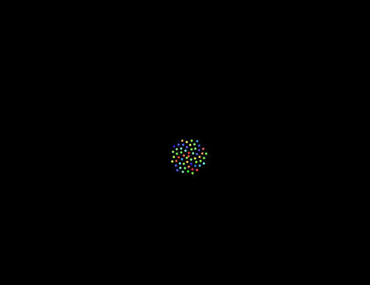
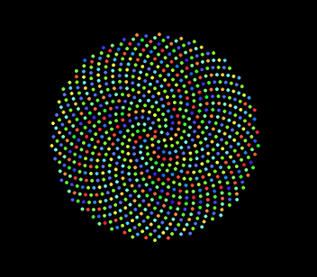
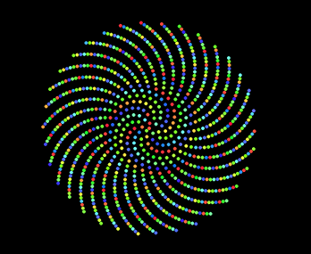

## Phyllotaxis

 
 
In botany, phyllotaxis or phyllotaxy is the arrangement of leaves on a plant stem . Phyllotactic spirals form a distinctive class of patterns in nature. This is just an implementation of the pattern. To view, click [here](https://samagra14.github.io/phyllotaxis).
 

Physical models of phyllotaxis date back to Airy's experiment of packing hard spheres. Gerrit van Iterson diagrammed grids imagined on a cylinder (Rhombic Lattices).Douady et al. showed that phyllotactic patterns emerge as self-organizing processes in dynamic systems.In 1991, Levitov proposed that lowest energy configurations of repulsive particles in cylindrical geometries reproduce the spirals of botanical phyllotaxis.

Close packing of spheres generates a dodecahedral tessellation with pentaprismic faces. Pentaprismic symmetry is related to the Fibonacci series and the golden section of classical geometry.

### The Planar model
In order to describe the pattern of florets (or seeds) in a sunflower head,
Vogel proposed the formula    

<b>  φ = n ∗ 137.5◦
,      r = c
√n    
</b>

where:
* n is the ordering number of a floret, counting outward from the
center. This is the reverse of floret age in a real plant.

* φ is the angle between a reference direction and the position vector
of the nth floret in a polar coordinate system originating at
the center of the capitulum. It follows that the divergence angle
between the position vectors of any two successive florets is
constant, α = 137.5◦.

* r is the distance between the center of the capitulum and the
center of the nth floret, given a constant scaling parameter c.

### Patterns with various diverging angles

α = 137.3◦

α = 137.5◦

α = 137.6◦

### Todos
1. Allow continuous change of diverging angles
2. Provide options for color hue with different combinations of __ r __ and __ φ __ .

### Contributing
Just send a PR.

### Sources
* [Phyllotaxis on Wikipedia:](https://en.wikipedia.org/wiki/Phyllotaxis)
* [Algorithmic Botany - Phyllotaxis:](http://algorithmicbotany.org/papers/abop/abop-ch4.pdf)
* [Phyllotaxis example:](https://bl.ocks.org/mbostock/11463507)

### This does nothing, Why did you make this ?
I was bored (kidding, just to explore maths in nature).
